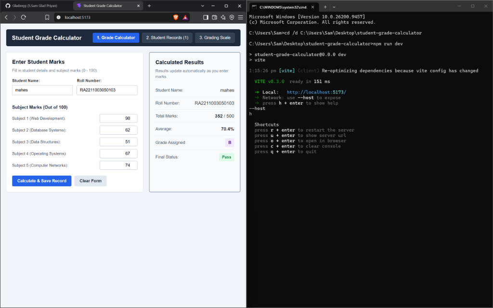
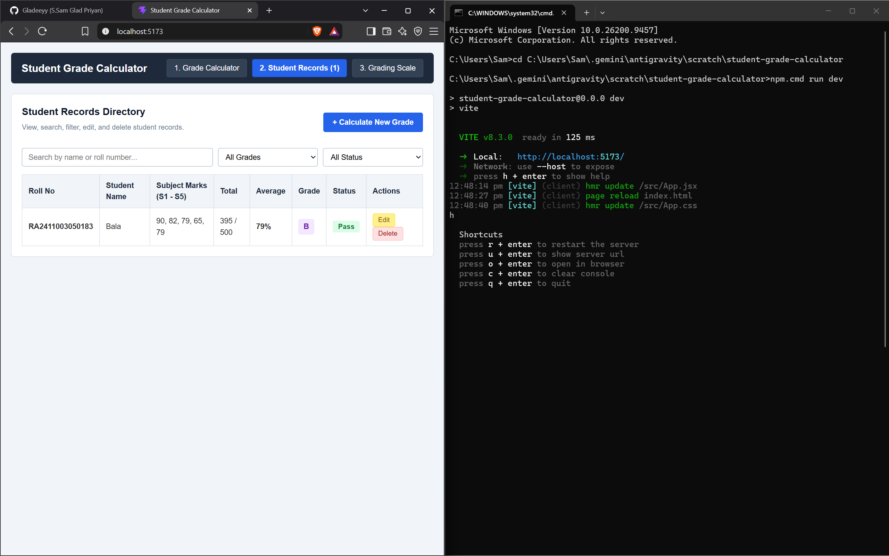
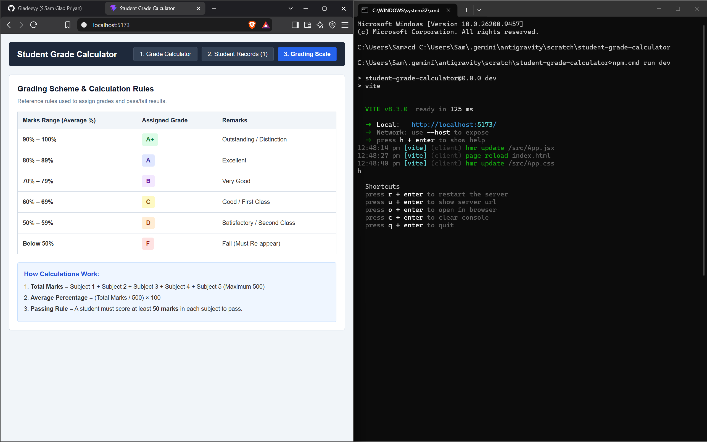

# Student Grade Calculator (ReactJS Application)


---

## 📸 Application Screenshots

### 1. Grade Calculator View (Entry & Live Calculation)


### 2. Student Records View (Search, Filter, Edit & Delete)


### 3. Grading Scheme & Calculation Rules


---

## 📖 How the Code Works (Simple Beginner Guide)

This application is built using simple, beginner-friendly ReactJS concepts. There are **no complex animations or transitions**, making it very easy to read and explain during viva and evaluation.

### 1. Project Files Structure:
```
student-grade-calculator/
├── src/
│   ├── main.jsx                     # Starts the React application
│   ├── App.jsx                      # Main component holding state & logic
│   ├── App.css                      # Clean, basic CSS styles (no animations)
│   ├── index.css                    # Basic layout reset
│   ├── utils/
│   │   └── gradeHelper.js           # 4 simple calculation functions
│   └── components/
│       ├── Navbar.jsx               # Navigation bar (3 pages)
│       ├── GradeCalculator.jsx      # Form to enter marks + live result box
│       ├── StudentRecords.jsx       # Table showing saved student records (search/filter/edit/delete)
│       └── GradingScale.jsx         # Reference table showing grade cutoffs
```

---

## 🧮 Core Logic & Calculations (`src/utils/gradeHelper.js`)

All calculations are written as simple JavaScript functions:

### 1. Calculate Total:
Adds the marks of all 5 subjects together:
```javascript
export function calculateTotal(marks) {
  const m1 = Number(marks.subject1) || 0;
  const m2 = Number(marks.subject2) || 0;
  const m3 = Number(marks.subject3) || 0;
  const m4 = Number(marks.subject4) || 0;
  const m5 = Number(marks.subject5) || 0;
  return m1 + m2 + m3 + m4 + m5;
}
```

### 2. Calculate Average:
Divides the total marks by 5:
```javascript
export function calculateAverage(total, numberOfSubjects = 5) {
  const avg = total / numberOfSubjects;
  return Number(avg.toFixed(2));
}
```

### 3. Assign Grade:
Checks the average and assigns standard letter grades:
```javascript
export function calculateGrade(average) {
  if (average >= 90) return 'A+';
  if (average >= 80) return 'A';
  if (average >= 70) return 'B';
  if (average >= 60) return 'C';
  if (average >= 50) return 'D';
  return 'F';
}
```

### 4. Check Pass or Fail:
A student passes only if they score at least 50 marks in each of the 5 subjects:
```javascript
export function checkPassStatus(marks) {
  const subjectList = [
    Number(marks.subject1) || 0,
    Number(marks.subject2) || 0,
    Number(marks.subject3) || 0,
    Number(marks.subject4) || 0,
    Number(marks.subject5) || 0
  ];
  const hasFailedSubject = subjectList.some(m => m < 50);
  return hasFailedSubject ? 'Fail' : 'Pass';
}
```

---

## ⚛️ React Hooks Used (`App.jsx`)

### `useState`:
- `activePage`: Tracks the current visible page (`calculator`, `records`, or `scale`).
- `students`: Stores the list of student records in memory.
- `studentData`: Stores what the user types into the form (Name, Roll Number, and 5 Marks).
- `liveTotal`, `liveAverage`, `liveGrade`, `liveStatus`: Stores the calculated results.
- `errorMessage`: Stores validation error text if inputs are invalid.

### `useEffect`:
- **Hook 1 (Automatic Calculation)**: Runs automatically whenever any mark input changes. It immediately calls `calculateTotal`, `calculateAverage`, and `calculateGrade` and updates the screen.
- **Hook 2 (Save to LocalStorage)**: Automatically saves the student records into the browser's `localStorage` so records are not lost on page reload.

---

## 📋 3 Functional Pages (Views)

1. **Page 1: Grade Calculator**
   - Inputs for: Student Name, Roll No, and 5 Subjects (Web Dev, DBMS, DSA, OS, Computer Networks).
   - Validates that marks are between 0 and 100.
   - Shows live calculated Total, Average, Grade, and Pass/Fail status.
   - Click **"Calculate & Save Record"** to save into the records list.

2. **Page 2: Student Records**
   - Displays all saved student results in a clean table.
   - **Search**: Instant search by Student Name or Roll Number.
   - **Filter**: Dropdown filter by Grade (`A+`, `A`, `B`, `C`, `D`, `F`) or Status (`Pass`/`Fail`).
   - **Edit**: Click "Edit" to reload a student's marks back into the calculator.
   - **Delete**: Click "Delete" to remove a record.

3. **Page 3: Grading Scale**
   - Shows a clean reference table with mark ranges, grades, and calculation rules.

---

## 🚀 How to Run Locally

1. Open PowerShell or Terminal in this folder:
   ```bash
   cd C:\Users\Sam\.gemini\antigravity\scratch\student-grade-calculator
   ```

2. Run the application:
   ```bash
   npm.cmd run dev
   ```

3. Open your browser at:
   ```
   http://localhost:5173
   ```
